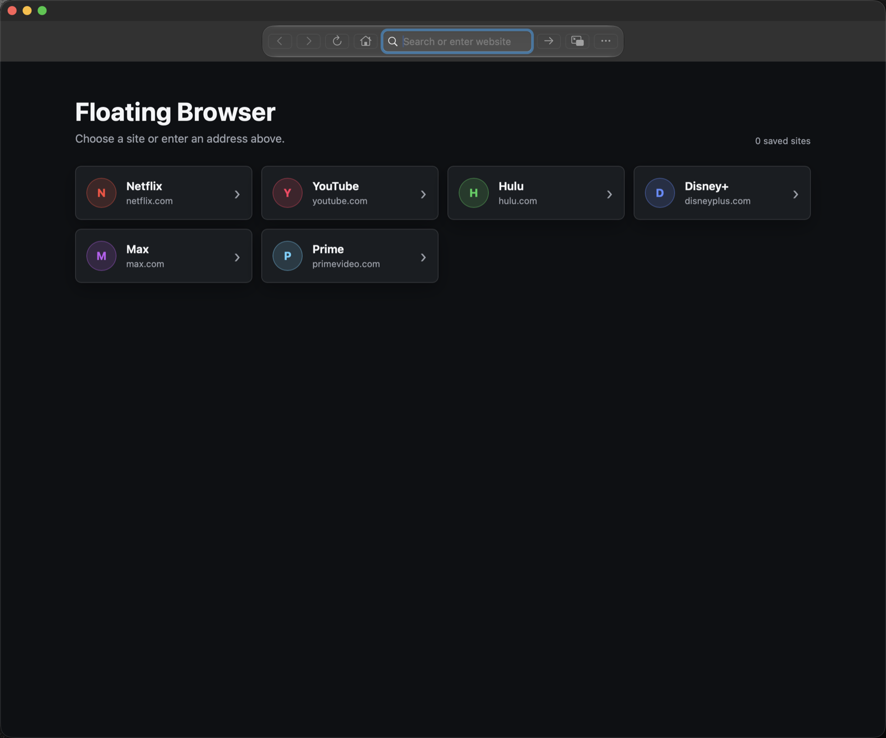

# Floating Browser

A small macOS browser window for keeping websites and web video visible above other apps without relying on Safari Picture-in-Picture.



## Install

Download the `.dmg` from the repository's **Releases** page. Open it, then drag **Floating Browser** into **Applications**.

Do not download GitHub's automatically generated "Source code" archives unless you intend to build the app yourself.

Floating Browser requires macOS 14 or later and supports both Apple silicon and Intel Macs.

### Unsigned Public Beta

The current free beta is not signed with an Apple Developer ID or notarized by Apple. macOS will block its first launch:

1. Try to open **Floating Browser** from Applications.
2. Open **System Settings > Privacy & Security**.
3. Scroll to Security and click **Open Anyway** for Floating Browser.
4. Confirm **Open**.

Do not disable Gatekeeper or run Terminal bypass commands. Read [UNSIGNED_BETA_INSTALL.md](UNSIGNED_BETA_INSTALL.md) before installing.

## Use

- Select the house button to return to the site launcher.
- Open any page, then choose **More > Add Current Site** to save it to the launcher.
- Open **More** to manage saved sites, open the page in Safari, change ad blocking, or toggle always-on-top behavior.
- Select the Mini Player button after video starts to create a compact borderless window; use the corner restore button to return to the full browser.
- Press `Command-L` to select the address field and `Command-R` to reload.
- Use **More > Open in Safari** when a streaming service refuses embedded playback.

Website behavior can change without an app update. Some services allow browsing but reject protected video in embedded WebKit views. The blocker is intentionally lighter than browser extensions such as uBlock Origin and pauses itself on major streaming services for compatibility.

Floating Browser is not affiliated with, endorsed by, or sponsored by any third-party service linked from its launcher.

## Privacy

Floating Browser has no developer analytics, advertising, or developer-operated data collection service. Website data stays in WebKit's local storage on the Mac and can be removed with **More > Clear Website Data**. See [PRIVACY.md](PRIVACY.md).

## Build From Source

Requirements:

- macOS 14 or later
- Xcode with the macOS SDK
- Swift 6

```sh
./build-local.sh
```

The local build installs to:

```text
/Applications/Floating Browser.app
```

Run the tests without installing:

```sh
swift test
```

Create the unsigned public-beta DMG and checksum:

```sh
./package-unsigned-beta.sh
```

## Contributing

Bug reports and focused pull requests are welcome. Never post streaming-account credentials, private URLs, cookies, or personal browsing information in an issue. See [CONTRIBUTING.md](CONTRIBUTING.md).

Floating Browser is released under the [MIT License](LICENSE).
